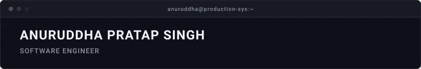

<p align="center">
  <a href="https://github.com/anuruddha-pratap-singh">
    
  </a>
</p>

<p align="center">
  <a href="https://github.com/anuruddha-pratap-singh">
    
  </a>
  <a href="https://www.linkedin.com/in/anuruddha-pratap/">
    
  </a>
  <a href="https://x.com/Anuruddha_PS">
    
  </a>
  <a href="https://leetcode.com/u/anuruddha-pratap/">
    
  </a>
  <a href="mailto:thecodexbit@gmail.com">
    
  </a>
</p>

---

<h3 align="center">
  <code>❯ Learn Tech By Building It</code>
</h3>

---

### `// TECHNICAL STACK & TOOLING`

#### ▫ Languages
<p align="left">
  
  
  
  
  
  
  
  
</p>

#### ▫ Frontend Development
<p align="left">
  
  
  
  
</p>

#### ▫ Backend & Architecture
<p align="left">
  
  
  
  
  
</p>

#### ▫ Databases & Cloud Services
<p align="left">
  
  
  
  
</p>

#### ▫ Tools & Environments
<p align="left">
  
  
  
  
  
  
  
</p>

---

### `// LEETCODE & PROBLEM SOLVING`

<div align="center">
  <a href="https://leetcode.com/u/anuruddha-pratap/">
    
  </a>
  <br />
  <p><b>50 Days Streak Badge Awarded</b> • Consistent Daily Algorithmic Problem Solving</p>
  <a href="https://leetcode.com/u/anuruddha-pratap/">
    
  </a>
</div>

---

### `// ACTIVITY & METRICS`

<div align="center">
  
  <br><br>
  
</div>

<br>

---

### `// TRANSMISSION & NETWORK`

Feel free to connect for open-source collaboration, backend architecture discussions, or system design inquiries:

```
LINKEDIN : https://www.linkedin.com/in/anuruddha-pratap/
X        : https://x.com/Anuruddha_PS
LEETCODE : https://leetcode.com/u/anuruddha-pratap/
GITHUB   : https://github.com/anuruddha-pratap-singh
```

<br />

<p align="center">
  <sub>Constructed with precision. No fluff, pure engineering.</sub>
</p>
